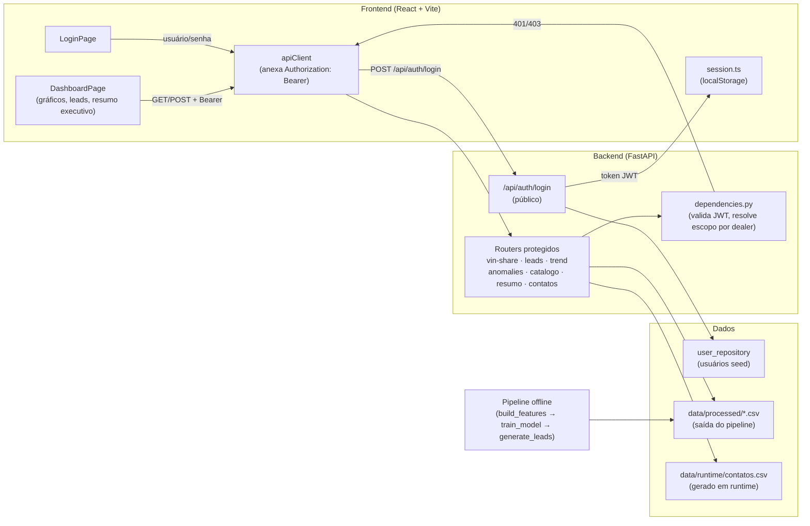
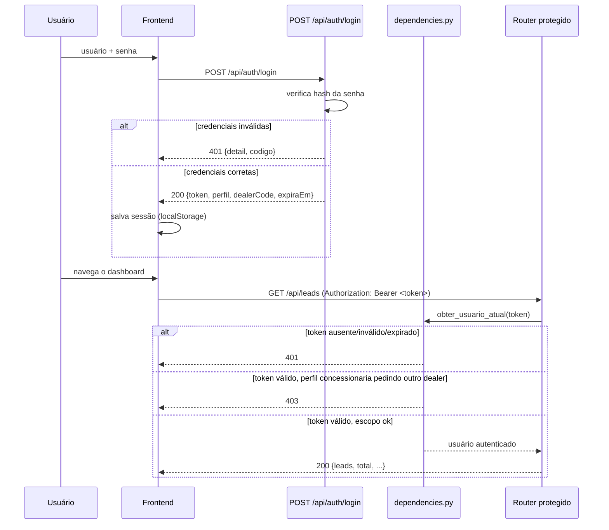

# ford-next — VIN Share Intelligence Hub

Desafio 02 (FIAP × Ford): reduzir a evasão silenciosa de clientes da rede oficial de pós-venda. A solução cobre os três pilares exigidos pelo desafio, conectados em um fluxo único — não três protótipos isolados:

1. **Análise e Visualização** — dashboard com VIN Share por concessionária, modelo, idade do veículo e tipo de serviço, mais um painel de anomalias.
2. **Geração de Leads e Modelagem Preditiva** — modelo treinado no histórico real de serviços, gerando um score de risco de evasão por veículo e uma lista de leads priorizada.
3. **Otimização da Jornada do Cliente** — motor de regras que transforma o score em uma ação concreta (lembrete, oferta ou contato ativo) e uma mensagem já personalizada para a concessionária usar.

Construído sobre o dataset real fornecido pela Ford: **602.788 ordens de serviço, 175.554 veículos únicos, 435 concessionárias, 20 modelos**, 2020–2026.

## Time

| Frente | Responsável |
|---|---|
| Visão, regras de negócio e integração | @0ldev |
| Dados & Machine Learning | @Bruno-Biletsky, @Guig3003 |
| Frontend & Dashboard | @pauloakira05 |

Board do projeto: [GitHub Projects — ford-next](https://github.com/users/0ldev/projects/2)

## Arquitetura

Clean Architecture nas duas pontas, backend e frontend, com a mesma separação de camadas:

```
backend/src/
├── domain/          # regras de negócio puras (risk_label, action_rules, message_templates,
│                    #   prioritization, security — hash/JWT, authorization — escopo por perfil)
├── application/      # casos de uso (features, treino do modelo, geração de leads, métricas)
├── infrastructure/    # acesso a dado (leitura de parquet/CSV, cache, modelo treinado,
│                    #   cadastro de usuários, histórico de contatos)
└── interfaces/
    ├── pipeline/      # scripts de ETL/treino, rodados offline — nunca dentro de uma requisição HTTP
    └── api/           # FastAPI — só lê dado já processado pelo pipeline; dependencies.py
                       #   traduz falha de autenticação/autorização em HTTPException

frontend/src/
├── domain/           # tipos/contratos (espelham o schema da API)
├── application/       # hooks (um por recurso: useVinShareData, useLeads, useCatalogo, useLogin, ...)
├── infrastructure/    # cliente HTTP (anexa o Bearer token), sessão (localStorage),
│                    #   fonte de dados (mock ↔ API real via USE_MOCK)
└── presentation/      # componentes React (LoginPage é a porta de entrada; App.tsx decide
                       #   entre login e dashboard conforme a sessão)
```

O ponto central é a separação entre **pipeline** (processamento pesado, rodado por fora, offline) e **API** (camada fina, só serve o que já foi calculado) — o servidor web nunca processa o Excel bruto dentro de uma requisição.

### Diagrama de componentes



### Fluxo de autenticação (sequência)



## Como rodar localmente

### 1. Backend — ambiente

```bash
cd backend
python3 -m venv .venv
.venv/bin/pip install -r requirements.txt
```

### 2. Backend — pipeline de dados (gera os arquivos em `data/processed/` e `models/`)

O dataset bruto (`data/raw/vin_share.zip`) já está versionado no repositório — não precisa copiar nada manualmente.

```bash
.venv/bin/python -m src.interfaces.pipeline.build_features        # tabela de features por VIN
.venv/bin/python -m src.interfaces.pipeline.build_service_history # histórico normalizado (usado pelo VIN Share/tendência/anomalias)
.venv/bin/python -m src.interfaces.pipeline.train_model            # treina e salva o modelo
.venv/bin/python -m src.interfaces.pipeline.generate_leads          # gera a lista de leads priorizada
```

### 3. Backend — subir a API

```bash
.venv/bin/python -m uvicorn src.interfaces.api.main:app --port 8000
```

Documentação interativa (Swagger UI, com botão "Authorize" para colar o Bearer token): `http://localhost:8000/docs`. Especificação OpenAPI crua: `/openapi.json`.

| Endpoint | Público? | Observação |
|---|---|---|
| `GET /health` | sim | |
| `POST /api/auth/login` | sim | único jeito de obter um token |
| `GET /api/vin-share` | não | perfil `concessionaria` escopado no próprio dealer |
| `GET /api/trend`, `GET /api/trend/concessionarias` | não | a segunda é escopada por dealer |
| `GET /api/anomalies`, `GET /api/catalogo`, `GET /api/resumo-executivo`, `GET /api/leads/distribuicao-score` | não | agregados de rede, sem escopo por dealer |
| `GET /api/leads`, `GET /api/leads/{vin}/acao` | não | escopados por dealer |
| `POST`/`GET /api/leads/{vin}/contatos` | não | registra/lista contato feito com o VIN; escopado por dealer |

### 4. Frontend

```bash
cd frontend
npm install
npm run dev
```

Abre em `http://localhost:5173` — o Vite faz proxy de `/api` para `localhost:8000`. `USE_MOCK` em `frontend/src/infrastructure/config.ts` está `false` (API real); mude para `true` para rodar o dashboard sem o backend no ar (o login também funciona no modo mock, com os mesmos usuários de demonstração).

## Autenticação e perfis de acesso

Toda a API (exceto `/health` e `/api/auth/login`) exige `Authorization: Bearer <token>`, obtido em `POST /api/auth/login`. Dois perfis:

| Perfil | Usuário demo | Senha | Acesso |
|---|---|---|---|
| `gestor` | `gestor` | `gestor123` | rede inteira, sem restrição |
| `concessionaria` | `concessionaria6693` | `dealer123` | só o dealer `6693` — pedir outro dealer devolve `403` |

```bash
# login
curl -X POST http://localhost:8000/api/auth/login \
  -H "Content-Type: application/json" \
  -d '{"usuario": "gestor", "senha": "gestor123"}'

# usa o token retornado
curl http://localhost:8000/api/leads -H "Authorization: Bearer <token>"
```

Token JWT (HS256), expira em 60 minutos (`backend/src/domain/security.py`). Segredo de assinatura via variável de ambiente `JWT_SECRET` — sem ela, cai num valor de desenvolvimento (não usar assim em produção). Regras de escopo por perfil em `backend/src/domain/authorization.py`.

## Testes

```bash
# Backend (357+ testes, incluindo autenticação/autorização/JWT)
cd backend && .venv/bin/python -m pytest tests/ -q

# Frontend
cd frontend && npx vitest run && npx tsc -b
```

## Limitações conhecidas (transparência técnica)

- **O rótulo de risco é um proxy**, construído a partir do próprio histórico de serviço (`gap_relativo` vs. intervalo mediano do modelo) — o dataset não tem um dado confirmado de "saiu da rede". Com o threshold escolhido (2,0×), ~72% da frota aparece como "em risco"; a metodologia completa e a justificativa do threshold estão documentadas em `backend/src/domain/risk_label.py`.
- **`ServiceType` real tem um único valor** ("Maintenance") — o filtro de tipo de serviço no dashboard existe, mas é pouco discriminante com os dados atuais.
- **Sem cadastro de nome de concessionária** — o dataset só tem o código numérico (`DealerCode`); o dashboard mostra o código quando não há nome mockado correspondente.

## Documentação adicional

- Plano de execução original: `plano_desafio02_vinshare.md` (fora deste repositório)
- Apresentação final: [`apresentacao_final.pptx`](./apresentacao_final.pptx)
- Roteiro do pitch (texto, com timing por bloco): issue [#10](https://github.com/0ldev/ford-next/issues/10)
- Checklist de critérios de sucesso: issue [#9](https://github.com/0ldev/ford-next/issues/9)
