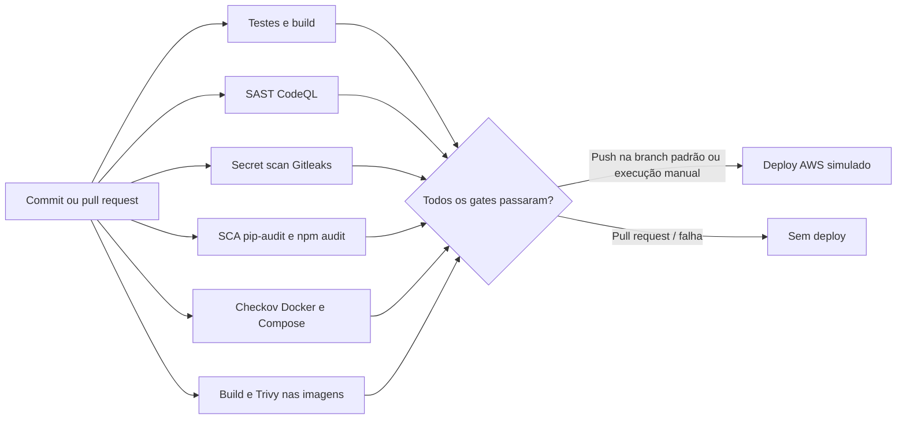

# ford-next — VIN Share Intelligence Hub

Desafio 02 (FIAP × Ford): reduzir a evasão silenciosa de clientes da rede oficial de pós-venda. A solução cobre os três pilares exigidos pelo desafio, conectados em um fluxo único — não três protótipos isolados:

1. **Análise e Visualização** — dashboard com VIN Share por concessionária, modelo, idade do veículo e tipo de serviço, mais um painel de anomalias.
2. **Geração de Leads e Modelagem Preditiva** — modelo treinado no histórico real de serviços, gerando um score de risco de evasão por veículo e uma lista de leads priorizada.
3. **Otimização da Jornada do Cliente** — motor de regras que transforma o score em uma ação concreta (lembrete, oferta ou contato ativo) e uma mensagem já personalizada para a concessionária usar.

Construído sobre o dataset real fornecido pela Ford: **602.788 ordens de serviço, 175.554 veículos únicos, 435 concessionárias, 20 modelos**, 2020–2026.

## Time

| Frente | Responsável |
|---|---|
| Visão, regras de negócio e integração | @0ldev |
| Dados & Machine Learning | @Bruno-Biletsky, @Guig3003 |
| Frontend & Dashboard | @pauloakira05 |

Board do projeto: [GitHub Projects — ford-next](https://github.com/users/0ldev/projects/2)

## Arquitetura

Clean Architecture nas duas pontas, backend e frontend, com a mesma separação de camadas:

```
backend/src/
├── domain/          # regras de negócio puras (risk_label, action_rules, message_templates, prioritization)
├── application/      # casos de uso (features, treino do modelo, geração de leads, métricas)
├── infrastructure/    # acesso a dados (leitura de parquet/CSV, cache, modelo treinado)
└── interfaces/
    ├── pipeline/      # scripts de ETL/treino, rodados offline — nunca dentro de uma requisição HTTP
    └── api/           # FastAPI — só lê dados já processados pelo pipeline

frontend/src/
├── domain/           # tipos/contratos (espelham o schema da API)
├── application/       # hooks (um por recurso: useVinShareData, useLeads, useCatalogo, ...)
├── infrastructure/    # cliente HTTP, fonte de dados (mock ↔ API real via USE_MOCK)
└── presentation/      # componentes React
```

O ponto central é a separação entre **pipeline** (processamento pesado, rodado por fora, offline) e **API** (camada fina, só serve o que já foi calculado) — o servidor web nunca processa o Excel bruto dentro de uma requisição.

## Como rodar localmente

### 1. Backend — ambiente

```bash
cd backend
python3 -m venv .venv
.venv/bin/pip install -r requirements.txt
```

### 2. Backend — pipeline de dados (gera os arquivos em `data/processed/` e `models/`)

O dataset bruto (`data/raw/vin_share.zip`) já está versionado no repositório — não precisa copiar nada manualmente.

```bash
.venv/bin/python -m src.interfaces.pipeline.build_features        # tabela de features por VIN
.venv/bin/python -m src.interfaces.pipeline.build_service_history # histórico normalizado (usado pelo VIN Share/tendência/anomalias)
.venv/bin/python -m src.interfaces.pipeline.train_model            # treina e salva o modelo
.venv/bin/python -m src.interfaces.pipeline.generate_leads          # gera a lista de leads priorizada
```

### 3. Backend — subir a API

```bash
.venv/bin/python -m uvicorn src.interfaces.api.main:app --port 8000
```

Endpoints: `/health`, `/api/vin-share`, `/api/trend`, `/api/anomalies`, `/api/leads`, `/api/leads/{vin}/acao`, `/api/catalogo`.

### 4. Frontend

```bash
cd frontend
npm install
npm run dev
```

Abre em `http://localhost:5173` — o Vite faz proxy de `/api` para `localhost:8000`. `USE_MOCK` em `frontend/src/infrastructure/config.ts` está `false` (API real); mude para `true` para rodar o dashboard sem o backend no ar.

## Como rodar com Docker

Pré-requisito: Docker Desktop instalado e em execução, com Docker Compose v2.

Na pasta raiz do repositório, execute:

```powershell
docker compose up --build
```

Na primeira execução, o serviço `pipeline` processa `backend/data/raw/vin_share.zip`, treina o modelo e grava os arquivos em volumes Docker. Quando ele termina, a API inicia; o serviço web publica o dashboard em <http://localhost:8080> e encaminha as chamadas `/api` para a API dentro da rede do Compose. Os dados processados persistem entre reinicializações.

Verificações e operação:

```powershell
docker compose ps
docker compose logs -f pipeline api web
Invoke-RestMethod http://localhost:8080/health
Invoke-RestMethod http://localhost:8080/health-api
```

Para parar, use `Ctrl+C` e depois `docker compose down`. Para reconstruir as imagens após mudanças, execute novamente `docker compose up --build`. O backend não publica uma porta diretamente no host; o acesso à API passa pelo proxy web. Logs da aplicação vão para a saída padrão dos contêineres e podem ser consultados com `docker compose logs`.

O Compose aplica uma configuração local endurecida (processos sem root, filesystem somente leitura, remoção de capabilities e `no-new-privileges`). Isso coloca a aplicação para rodar em contêiner, mas não substitui os demais itens da etapa de cibersegurança da apresentação: análise de dependências/segredos/imagens no CI, infraestrutura como código para deploy, dashboards e alertas, e evidências de conformidade ainda precisam ser definidos para o ambiente alvo.

## Pipeline DevSecOps AWS (simulado)

O workflow [`.github/workflows/devsecops-aws-mock.yml`](.github/workflows/devsecops-aws-mock.yml) executa em push, pull request e manualmente pela aba **Actions** do GitHub. Ele roda os testes Python e frontend, SAST com CodeQL, secret scanning com Gitleaks, SCA com `pip-audit` e `npm audit`, análise do Compose/Dockerfiles/workflows com Checkov e build mais scan Trivy das imagens.

Após todos os gates passarem, o job final publica um resumo de deploy demonstrativo para ECS/ECR. Ele não conecta à AWS, não usa credenciais e não cria recursos. A infraestrutura AWS, observabilidade gerenciada e integração OIDC para deploy real continuam fora deste mock; antes de habilitar AWS real, também será necessário revisar findings dos scanners e proteger os ambientes/secrets do repositório.



## Testes

```bash
# Backend (271+ testes)
cd backend && .venv/bin/python -m pytest tests/ -q

# Frontend
cd frontend && npx vitest run && npx tsc -b
```

## Limitações conhecidas (transparência técnica)

- **O rótulo de risco é um proxy**, construído a partir do próprio histórico de serviço (`gap_relativo` vs. intervalo mediano do modelo) — o dataset não tem um dado confirmado de "saiu da rede". Com o threshold escolhido (2,0×), ~72% da frota aparece como "em risco"; a metodologia completa e a justificativa do threshold estão documentadas em `backend/src/domain/risk_label.py`.
- **`ServiceType` real tem um único valor** ("Maintenance") — o filtro de tipo de serviço no dashboard existe, mas é pouco discriminante com os dados atuais.
- **Sem cadastro de nome de concessionária** — o dataset só tem o código numérico (`DealerCode`); o dashboard mostra o código quando não há nome mockado correspondente.

## Documentação adicional

- Plano de execução original: `plano_desafio02_vinshare.md` (fora deste repositório)
- Apresentação final: [`apresentacao_final.pptx`](./apresentacao_final.pptx)
- Roteiro do pitch (texto, com timing por bloco): issue [#10](https://github.com/0ldev/ford-next/issues/10)
- Checklist de critérios de sucesso: issue [#9](https://github.com/0ldev/ford-next/issues/9)
